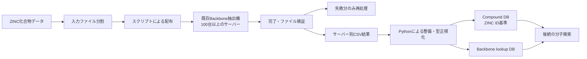

# 大規模化合物Backboneデータインフラの構築

**Language:** [English](./README.md) | [한국어](./README.ko.md) | [日本語](./README.ja.md)

## プロジェクト概要

> **1億件を超えるZINC化合物データに既存のBackbone抽出機能を適用し、100台以上のサーバーでのバッチ実行、失敗復旧、結果整備、SQLite DB構築を担当したデータエンジニアリングプロジェクトです。**

| 項目                   | 内容                                                                |
| -------------------- | ----------------------------------------------------------------- |
| 担当役割                 | Data Engineer                                                     |
| 領域                   | 計算創薬（Computational Drug Discovery）                                |
| データ規模                | ZINC化合物 1億件以上                                                     |
| 実行規模                 | 計算サーバー 100台以上                                                     |
| 主な貢献                 | Backbone DB構築と大規模バッチ運用                                            |
| 主要技術                 | Python · Shell · Linux · tmux · SQLite                            |
| Engineering Keywords | Batch Processing · Recovery · Storage Optimization · Data Quality |

## 1. 背景

化合物構造検索と後続スクリーニングに利用するため、取得済みの大規模ZINC SMILESデータに既存の**Backbone抽出ロジック**を適用し、検索可能なDBとして整備する必要がありました。

対象は1億件を超える化合物データでした。単一サーバーでの処理には長い時間がかかり、計算中に発生する大量の小さなファイルは共有NASのI/O負荷にもなります。また当時は、クラスタースケジューラーや自動リトライ機構を使わず、人が実行状態を確認して次のバッチを運用する環境でした。

私は抽出アルゴリズムそのものではなく、**既存ツールを大規模データ上で実行し、検証し、検索用DBに蓄積するための運用・データ処理レイヤー**を担当しました。

## 2. 担当範囲

### 実施したこと

- 入力データを一定単位に分割し、100台以上のサーバーへ配布
- Python・Shell・`scp`による反復配布の自動化
- `tmux synchronize-panes`による実行環境とコマンド準備
- 終了メッセージおよびoutputファイル数・サイズに基づく結果検証
- 失敗inputのみを再分割・再配布するrecovery loopの設計
- サーバー別CSVの整備とSQLiteベースのCompound DB / Backbone lookup DB構築
- 処理量、失敗、再割当、完了予定時刻をExcelで管理・報告
- ローカルディスクで圧縮しNASへ保管するストレージ運用の改善

### 直接開発の対象外だったこと

- `1D Scan Version3`の中核検索アルゴリズム
- 化合物Backbone抽出アルゴリズム
- クラスタースケジューラーまたは自動retry system
- NASおよびネットワークインフラ自体の設計

この区分は、検索アルゴリズムの開発と大規模データ運用の責任範囲を明確にするためのものです。

## 3. 処理フロー

## 4. 主な課題と対応

### 4.1 多数サーバーへの一貫した作業配布

入力データを分割した後、サーバーアドレス一覧を読むPython/Shellスクリプトで各サーバーへ配布しました。接続後は`tmux synchronize-panes`を使い、同じ作業場所と実行コマンドを準備して反復的な手作業を減らしました。

これは完全自動のスケジューリングシステムではありませんでしたが、当時の環境で多くのサーバーによるバッチを、人が把握・制御できる形で運用するための実用的な方法でした。

### 4.2 全体再実行ではなく失敗分だけを復旧

従来は、あるサーバーで障害が起きると、そのサーバーに割り当てられた作業全体を再実行していました。私はバッチ終了後に失敗inputをまとめて収集し、失敗分のみを再分割・再配布・再実行するrecovery loopに変更しました。

これにより、成功済みの作業を不要に繰り返さず、次の作業時点と更新後の完了予定時刻に基づいて運用できました。

### 4.3 共有NASではなく計算サーバーで圧縮

実行結果には、保存が必要な小さな中間ファイルが多数含まれていました。NAS内で圧縮や過度なI/Oを実行すると共有ストレージ全体に負荷を与えるため、結果は各計算サーバーのローカルディスクで`tar.bz2`に圧縮しました。

圧縮速度は`pbzip2`のようなマルチスレッド方式で改善し、NASは計算場所ではなく最終archiveの保管先として使用しました。archiveの転送もNAS負荷を考慮し、サーバーごとに順次実行しました。

### 4.4 サーバー別の結果を検索可能なデータに変換

各サーバーで生成されたCSVをPythonで整備しました。全カラムが一致する重複行を除去し、カラムとデータ型を整理しました。

整備済みデータはSQLiteにロードし、次の二つのレイヤーとして構成しました。

- **Compound DB:** 化合物1件につき1行。ZINC IDを基準にSMILES、Backbone、ring count、ZINC提供の化学特性を管理
- **Backbone lookup DB:** Backboneを基準に候補を検索するための別lookupレイヤー

## 5. 結果検証と運用管理

大規模処理の検証では、複雑な監視システムよりも現場で信頼できる確認手順を明確にすることを重視しました。

- 終了メッセージで一次的なエラー有無を確認
- outputディレクトリのファイル数とサイズで二次確認
- サーバーごとのinput数、output数、所要時間、失敗件数、再割当、更新後ETAをExcelに記録
- 現在バッチの結果と次の作業計画を併せてチームリーダーへ報告

この管理方式により、障害を一か所に集約して判断し、復旧作業を計画するための運用情報を確保しました。

## 6. 技術的成果

- 既存の科学計算ツールで**1億件以上の化合物データ**を処理・整備できる実行経路を構築
- **100台以上のサーバー**で実行されるバッチの配布、検証、失敗復旧フローを運用
- 失敗分のみの再処理により、成功済み作業の不要な再実行を削減
- NAS I/Oを考慮したローカル圧縮・順次archive転送方式を定着
- 後続の分子検索に利用できるZINC ID基準Compound DBとBackbone lookup DBを構築

## 7. 使用技術

| 分野     | 技術                                           |
| ------ | -------------------------------------------- |
| 自動化    | Python, Shell scripting                      |
| データ処理  | CSV整備、重複除去、型正規化                              |
| データベース | SQLite                                       |
| サーバー運用 | Linux, tmux, `scp`, `cp`                     |
| ストレージ  | `tar`, bzip2, `pbzip2`, NAS archive workflow |
| 運用管理   | Excel                                        |

## 8. この経験から得たこと

大規模な科学計算環境では、アルゴリズムだけでシステムは完成しません。入力の分割、失敗の収集、結果の検証、共有ストレージへの負荷まで設計されて初めて、作業を継続して実行できます。

この経験を通じて、データプラットフォームの価値は新しいアルゴリズムを作ることだけではなく、既存ツールを**実行可能・可観測・復旧可能・運用可能なシステム**にすることにもあると学びました。