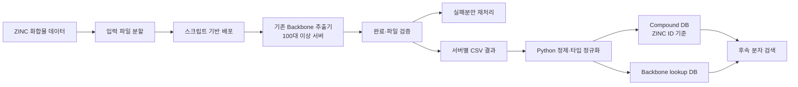

# 대규모 화합물 Backbone 데이터 인프라 구축

**Language:** [English](./README.md) | [한국어](./README.ko.md) | [日本語](./README.ja.md)

## 프로젝트 한눈에 보기

> **1억 건 이상 ZINC 화합물 데이터에 기존 Backbone 추출기를 적용하고, 100대 이상 서버의 배치 실행·실패 복구·결과 정제·SQLite DB 구축을 담당한 데이터 엔지니어링 프로젝트입니다.**

| 항목 | 내용 |
|---|---|
| 담당 역할 | Data Engineer |
| 도메인 | 계산 신약개발(Computational Drug Discovery) |
| 데이터 규모 | ZINC 화합물 1억 건 이상 |
| 실행 규모 | 계산 서버 100대 이상 |
| 핵심 기여 | Backbone DB 구축 및 대규모 배치 운영 |
| 주요 기술 | Python · Shell · Linux · tmux · SQLite |
| 엔지니어링 키워드 | Batch Processing · Recovery · Storage Optimization · Data Quality |

## 1. 업무 배경

화합물 구조 검색과 후속 스크리닝에 활용하기 위해, 확보 가능한 대규모 ZINC SMILES 데이터 전체에 기존의 **Backbone 추출 로직**을 적용하고 검색용 DB로 정리하는 작업이 필요했습니다.

문제는 데이터 규모였습니다. 1억 건이 넘는 화합물을 단일 서버에서 처리하기에는 시간이 오래 걸리고, 계산 중 생성되는 수많은 파일은 공유 NAS의 I/O 부담으로 이어질 수 있었습니다. 또한 당시에는 클러스터 스케줄러나 자동 재시도 체계 없이 사람이 실행 상태를 확인하고 다음 배치를 운영해야 했습니다.

이 작업에서 저는 추출 알고리즘 자체를 개발하기보다, **기존 도구가 대규모 데이터에서 실제로 안정적으로 돌아가고 결과가 DB로 쌓이도록 만드는 운영·데이터 처리 계층**을 담당했습니다.

## 2. 담당 범위

### 직접 수행한 일

- 입력 데이터를 일정 단위로 분할하고 100대 이상 서버에 배포
- Python·Shell·`scp`를 사용한 반복 배포 자동화
- `tmux synchronize-panes`를 사용한 실행 환경 및 명령 준비
- 완료 메시지, output 파일 수·크기 기반의 결과 검증
- 실패 input만 모아 재분할·재배포하는 recovery loop 설계
- 서버별 CSV 결과 정제 및 SQLite 기반 Compound DB / Backbone lookup DB 구축
- 서버별 처리 현황·실패·재할당·예상 완료 시각을 Excel로 관리·보고
- 로컬 서버 디스크에서 압축 후 NAS에 보관하는 스토리지 운영 방식 개선

### 직접 개발하지 않은 영역

- `1D Scan Version3` 핵심 검색 알고리즘
- 화합물 Backbone 추출 알고리즘
- 클러스터 스케줄러 또는 자동 retry system
- NAS 및 네트워크 인프라 자체의 설계

이 구분은 알고리즘 개발과 대규모 데이터 운영을 명확히 분리하기 위한 것입니다.

## 3. 전체 처리 흐름

## 4. 주요 해결 과제와 접근 방식

### 4.1 많은 서버에 같은 작업을 일관되게 배포

입력 데이터를 분할한 뒤, 서버 주소 목록을 읽는 Python/Shell 스크립트로 각 서버에 배포했습니다. 서버 접속 후에는 `tmux synchronize-panes`로 동일한 작업 위치와 실행 명령을 준비해 반복적인 수작업을 줄였습니다.

이는 완전 자동화된 스케줄링 시스템은 아니었지만, 당시 환경에서 다수 서버의 대규모 배치를 사람이 통제 가능한 방식으로 운영하기 위한 실용적인 방법이었습니다.

### 4.2 전체 재실행 대신 실패분만 복구

기존 방식은 한 서버에서 장애가 나면 그 서버에 할당된 작업 전체를 다시 실행하는 방식이었습니다. 저는 배치가 끝난 뒤 실패 input을 한 번에 수집하고, 실패분만 다시 분할·배포·실행하도록 recovery loop를 바꿨습니다.

그 결과 이미 성공한 작업을 불필요하게 다시 돌리지 않고, 다음 작업 시점과 예상 완료 시각을 기준으로 운영할 수 있었습니다.

### 4.3 공유 NAS가 아닌 계산 서버에서 압축

실행 결과에는 보관이 필요한 작은 중간 파일이 다수 생성되었습니다. NAS 안에서 압축이나 과도한 I/O를 수행하면 공유 스토리지 전체에 부담을 줄 수 있었기 때문에, 결과물은 각 계산 서버의 로컬 디스크에서 `tar.bz2`로 압축했습니다.

압축 속도는 `pbzip2`와 같은 멀티스레드 방식을 활용해 개선했고, NAS는 계산 공간이 아닌 최종 archive 보관처로 사용했습니다. archive 전송도 NAS 부하를 고려해 서버별로 순차 진행했습니다.

### 4.4 서버별 결과를 검색 가능한 데이터로 전환

각 서버에서 생성된 CSV를 Python으로 정제했습니다. 이 과정에서 전체 컬럼이 동일한 중복 행을 제거하고, 컬럼과 데이터 타입을 정리했습니다.

정제된 결과는 SQLite에 적재하여 다음 두 계층으로 구성했습니다.

- **Compound DB:** 화합물 한 건당 한 행. ZINC ID를 기준으로 SMILES, Backbone, ring count, ZINC 제공 화학 속성을 관리
- **Backbone lookup DB:** Backbone 기준으로 후보를 찾기 위한 별도 lookup 계층

## 5. 결과 검증과 운영 관리

대량 작업의 검증은 복잡한 모니터링 시스템보다, 현장에서 신뢰할 수 있는 확인 절차를 명확히 하는 방식으로 진행했습니다.

- 종료 메시지로 1차 에러 여부 확인
- output 디렉터리의 파일 수와 파일 크기로 2차 확인
- 서버별 input 수, output 수, 소요 시간, 실패 건수, 재할당 현황, 수정된 ETA를 Excel로 기록
- 현재 배치의 결과와 다음 작업 계획을 함께 팀 리더에게 보고

이 체계는 단순하지만, 장애 상태를 한곳에 모아 판단하고 복구 작업을 계획하는 데 필요한 운영 정보를 제공했습니다.

## 6. 기술적 성과

- 기존 과학 계산 도구를 활용해 **1억 건 이상 화합물 데이터**를 처리·정리할 수 있는 실행 경로 구축
- **100대 이상 서버**에서 실행되는 배치 작업의 배포, 검증, 실패 복구 흐름 운영
- 실패분만 재처리하여 성공한 작업의 불필요한 재실행 감소
- NAS I/O를 고려한 로컬 압축·순차 archive 전송 방식 정착
- 후속 분자 검색에 활용 가능한 ZINC ID 기반 Compound DB와 Backbone lookup DB 구축

## 7. 사용 기술

| 분야 | 기술 |
|---|---|
| 자동화 | Python, Shell scripting |
| 데이터 처리 | CSV 정제, 중복 제거, 타입 정규화 |
| 데이터베이스 | SQLite |
| 서버 운영 | Linux, tmux, `scp`, `cp` |
| 스토리지 | `tar`, bzip2, `pbzip2`, NAS archive workflow |
| 운영 관리 | Excel |

## 8. 이 경험을 통해 배운 점

대규모 과학 계산 환경에서는 알고리즘만으로 시스템이 완성되지 않습니다. 입력을 어떻게 나누고, 실패를 어떻게 모으고, 결과를 어떻게 확인하며, 공유 스토리지에 어떤 부담을 주지 않을지까지 설계되어야 작업이 계속 진행될 수 있습니다.

이 경험을 통해 저는 데이터 플랫폼의 가치는 새로운 알고리즘을 만드는 데만 있지 않고, 기존 도구를 **실행 가능하고, 관찰 가능하며, 복구 가능하고, 운영 가능한 시스템**으로 만드는 데에도 있다는 점을 배웠습니다.

---

### 근거 범위

본 문서는 2020–2021년 연구노트와 기술 복원 기록을 기반으로 작성했습니다. Backbone DB, `1D Scan Version3`, SMILES·ring·property·schema 작업, CSV/DB 흐름 및 1D/2D scan 문맥은 연구노트에서 확인했습니다. 정확한 최대 처리 건수와 최대 서버 수는 확정하지 않고, 보수적으로 **1억 건 이상**, **100대 이상**으로 표기했습니다.
