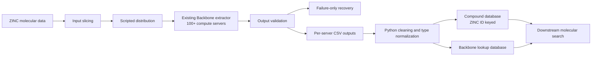

# High-Throughput Molecular Backbone Data Infrastructure

**Language:** [English](./README.md) | [한국어](./README.ko.md) | [日本語](./README.ja.md)

## 0. At a Glance

| Category             | Summary                                                         |
| -------------------- | --------------------------------------------------------------- |
| Role                 | Data Engineer                                                   |
| Domain               | Computational Drug Discovery                                    |
| Dataset scale        | 100M+ ZINC molecular records                                    |
| Compute scale        | 100+ compute servers                                            |
| Core contribution    | Large-scale Backbone database construction and batch operations |
| Primary technologies | Python · Shell · Linux · tmux · SQLite                          |
| Engineering themes   | Batch reliability · Storage-aware operations · Data quality     |

## 1. Project Overview

This project documents the data infrastructure built to make an existing molecular **Backbone extraction** capability usable across a large ZINC chemical dataset.

My contribution was not the molecular search algorithm or the Backbone extraction algorithm itself. I owned the operational and data-engineering work around it: partitioning inputs, coordinating runs across 100+ servers, recovering failed partitions, validating outputs, and building SQLite databases for downstream molecular search.

## 2. The Engineering Problem

The available ZINC SMILES dataset contained more than 100 million molecular records. Processing this volume with the existing extractor required practical answers to several operational problems:

- distribute work consistently across many compute servers;
- verify completion without a cluster scheduler;
- recover only failed work instead of rerunning successful partitions;
- preserve large volumes of required intermediate artifacts without overloading shared NAS storage; and
- consolidate server-level CSV outputs into a queryable molecular database.

## 3. System Overview

### Data model

- **Compound database:** one row per compound, keyed by ZINC ID.
- **Stored data:** SMILES, Backbone representation, ring count, and available ZINC-provided chemical properties.
- **Lookup database:** a separate Backbone-oriented SQLite lookup layer for downstream retrieval.

## 4. Engineering Contributions

### Multi-node batch execution

- Split the source dataset into fixed work partitions.
- Used Python and shell scripts to distribute inputs from a server list with `scp`.
- Used `tmux synchronize-panes` to prepare identical working locations and commands across servers.
- Ran the existing Backbone extraction process across 100+ compute servers and consolidated the outputs.

### Operator-centered recovery loop

The inherited recovery approach restarted all work assigned to a failed server. I changed the operational loop to:

1. collect failed inputs after a batch completed;
2. repartition only those failed inputs;
3. redistribute them to available servers; and
4. rerun the recovery batch with a revised completion estimate.

This reduced avoidable reprocessing while retaining a workflow that operators could inspect and control directly.

### Output validation and reporting

- Verified completion messages and checked output file counts and sizes.
- Tracked server-level input volume, output volume, elapsed time, failures, reassignment, and expected completion time in Excel.
- Reported both the current batch result and the next execution plan to the team lead.

### Storage-aware artifact handling

The extraction workflow produced many required small intermediate files. To avoid heavy I/O on shared NAS storage:

- compressed completed artifacts on each compute server's local disk using `tar.bz2`;
- introduced multi-threaded compression with `pbzip2`; and
- treated NAS as an archive destination rather than a compute workspace.

Completed archives were transferred sequentially to manage shared NAS I/O. I also compared transfer approaches in the operating environment and retained `scp` for input distribution and `cp` for archive transfer to mounted storage.

### CSV-to-SQLite data pipeline

- Cleaned server-generated CSV outputs with Python.
- Applied exact-row deduplication and column/type normalization.
- Loaded the cleaned records into SQLite databases for compound-level access and Backbone-oriented lookup.

## 5. Technical Impact

- Established an operational path to process and organize **100M+ molecular records** with existing scientific software.
- Made large batch execution more recoverable by isolating and rerunning failed partitions only.
- Improved shared-storage safety by moving compression work to compute-server disks and using NAS for archival storage.
- Delivered structured molecular data that could support later 1D molecular search and screening workflows.

## 6. Scope Boundaries

To keep this portfolio accurate, the following were outside my direct ownership:

- development of the core **1D Scan Version3** molecular search algorithm;
- development of the molecular Backbone extraction algorithm;
- cluster scheduler or automatic retry-system implementation; and
- NAS or network-infrastructure design.

The research records confirm Backbone DB construction and the broader 1D/2D scan, scaffold, R-group, and ranking context. This portfolio focuses specifically on my contribution to the large-scale data and operations layer.

## 7. Tech Stack

| Category                 | Technologies                                  |
| ------------------------ | --------------------------------------------- |
| Programming & automation | Python, Shell scripting                       |
| Data processing          | CSV, data cleaning, type normalization        |
| Database                 | SQLite                                        |
| Compute operations       | Linux, tmux, `scp`, `cp`                      |
| Storage operations       | `tar`, bzip2, `pbzip2`, NAS archival workflow |
| Operational reporting    | Excel                                         |

## 8. Key Takeaway

This work shaped how I approach data-platform engineering: useful infrastructure is not only an algorithm or a scheduler. It is also the operational layer that makes large-scale scientific computation executable, observable, recoverable, and safe for the surrounding storage systems.